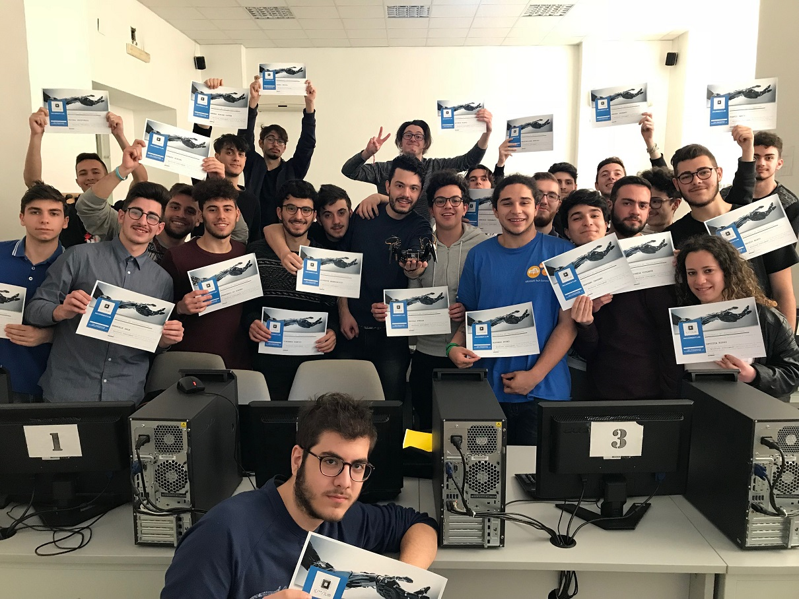

# Repository progetti Robotica Bioispirata @ IISS Panetti-Pitagora

## Cosa contiene il repository
Il repository contiene i seguenti sottoprogetti:
- Examples: Semplici progetti di esempio scritti in C#.
- Spiderbot: Applicativo principale dello spiderbot.
- XORSolver: Semplice MLP che risolve una disgiunzione esclusiva.

##### ~Tutti i progetti sono stati creati attraverso Visual Studio 2017~